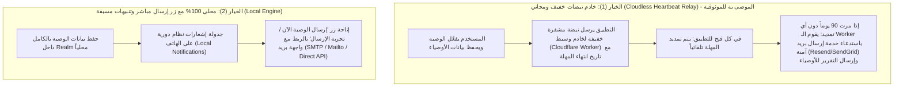

# 📜 وثيقة المقترحات والميزات المستقبلية: ميزة "الوصية المالية الرقمية"
# Feature Proposal: Digital Financial Will & Legacy (الوصية)

**تاريخ الإضافة:** سبتمبر 2026  
**الحالة:** مقترح مستقبلي معتمد للتوثيق والدراسة (Proposed / Under Consideration)  
**التصنيف:** الأمان، النسخ الاحتياطي، وإبراء الذمة المالية (Backup, Security & Financial Legacy)  
**الإصدار المستهدف:** v2.3.0+

---

## 1. ملخص الفكرة والهدف (Executive Summary)

في التطبيقات المالية وإدارة الديون الشخصية كـ **"الديوان"**، تُعد مسألة **حفظ حقوق الناس وإبراء الذمة** المقصد الأسمى؛ استناداً للمبدأ الشرعي والمالي: *«ما حق امرئ مسلم له شيء يوصي فيه، يبيت ليلتين إلا ووصيته مكتوبة عنده»*.

**الهدف من الميزة:**  
تمكين المستخدم من إعداد **"وصية مالية رقمية"** تتضمن حصراً شاملاً لجميع ديونه (ما له وما عليه) وتفاصيل أمواله، بحيث يتم إرسال نسخة **غير مشفرة وسهلة القراءة والفهم** تلقائياً عبر البريد الإلكتروني إلى أشخاص موثوقين يحددهم المستخدم كـ **"حَمَلة الوصية" (Will Trustees)** في حال انقطاع المستخدم عن فتح التطبيق لفترة زمنية محددة (Inactivity Timeout).

---

## 2. متطلبات الميزة التفصيلية (Functional Specifications)

### 2.1 حَمَلة الوصية (Trustees)
- **العدد:** من **1 إلى 5 أشخاص** كحد أقصى بحسب اختيار المستخدم.
- **البيانات المسجلة لكل حامل وصية:**
  - الاسم الكامل (Full Name) - إلزامي.
  - عنوان البريد الإلكتروني (Email Address) - إلزامي.
  - رقم الهاتف / الواتساب (Phone Number) - اختياري.
  - صلة القرابة أو الوصف (مثل: ابني، المحامي، أخي، صديق مقرب) - اختياري.
- **التحكم:** إمكانية إضافة، تعديل، أو حذف أي حامل وصية في أي وقت بسهولة.

### 2.2 فترة عدم النشاط ومهلة التحقق (Inactivity Timeout)
- **الفترات المتاحة للمستخدم للاختيار:**
  - 30 يوماً (شهر واحد)
  - 60 يوماً (شهران - فترة موصى بها)
  - 90 يوماً (ثلاثة أشهر - الافتراضي)
  - 180 يوماً (ستة أشهر)
- **آلية إعادة التعيين (Heartbeat Reset):**
  - في كل مرة يفتح فيها المستخدم التطبيق، يتم تلقائياً تحديث `lastActiveDate` إلى اللحظة الحالية وإعادة تصفير العداد الزمني.

### 2.3 تنبيهات إثبات السلامة (Dead Man's Switch Safety Check-ins)
لمنع إرسال الوصية بالخطأ أثناء سفر المستخدم أو انشغاله دون حدوث مكروه:
- قبل انتهاء المهلة المحددة، يُجدول التطبيق إشعارات تنبيهية تصاعدية على هاتف المستخدم:
  - **قبل 7 أيام:** إشعار تنبيهي لطيف: *"تذكير من الديوان: لم تسجل دخولك منذ فترة، افتح التطبيق لتأكيد نشاطك وتحديث بياناتك"*.
  - **قبل 3 أيام:** إشعار تحذيري متوسط: *"تنبيه وصية الديوان: اقتربت مهلة عدم النشاط المحددة للوصية، يُرجى فتح التطبيق لتأكيد سلامتك"*.
  - **قبل 24 ساعة:** إشعار عاجل: *"تنبيه حرج: سيتم إرسال وصيتك المالية لحملة الوصية غداً ما لم تسجل دخولك للتطبيق الآن"*.
- بمجرد فتح التطبيق، يُلغى التنبيه فوراً ويُعرض إشعار داخلي: *"تم تأكيد نشاطك وتجديد مهلة الوصية بنجاح"*.

### 2.4 طبيعة وشكل البيانات المرسلة (Data Delivery & Format)
**الشرط الحاكم:** *"البيانات المرسلة يجب أن تكون سهلة الوصول إليها والتعامل معها بالنسبة لحملة الوصية"*.  
نظراً لأن حملة الوصية (الورثة، الزوجة، الأبناء، الأصدقاء) ليسوا بالضرورة تقنيين ولا يملكون بالضرورة تطبيق الديوان:
1. **تقرير الوصية المقروء داخل صلب الإيميل (HTML Email Body):**
   - تصميم واضح وأنيق ومتجاوب للقراءة على الهواتف وأجهزة الكمبيوتر مباشرة دون الحاجة لبرامج إضافية.
   - **مقدمة الوصية:** اسم المستخدم، تاريخ إنشاء التقرير، ورسالة شخصية يكتبها المستخدم (مثل: *«بسم الله الرحمن الرحيم، هذه وصيتي بما لي وما عليّ من ديون وحقوق، أرجو البدء بسداد الديون قبل توزيع أي تركة...»*).
   - **جدول الديون المستحقة لك (Receivables - ديون لنا):**
     - اسم المدين، رقم هاتفه، المبلغ، العملة، تاريخ الاستحقاق، وأي ملاحظات مسجلة.
   - **جدول الديون المستحقة عليك (Payables - ديون علينا):**
     - اسم الدائن، رقم هاتفه، المبلغ، العملة، تاريخ الاستحقاق، وأي ملاحظات مسجلة.
   - **ملخص الحسابات والأصول (Accounts Summary):**
     - البنوك، المحافظ النقدية، والأرصدة التقريبية المسجلة.
   - **صافي الموقف المالي (Net Position):**
     - إجمالي ما لك، إجمالي ما عليك، وصافي الفارق.
2. **المرفقات (Attachments):**
   - **ملف PDF منسق وجاهز للطباعة (Print-ready PDF):** للرجوع إليه ورقياً أو تقديمه للجهات الشرعية والقضائية.
   - **ملف جدول بيانات (`.csv` / Excel):** يمكن فتحه بضغطة زر عبر Excel أو Google Sheets للفرز والتعديل.
   - **نسخة احتياطية رقمية كاملة غير مشفرة (`Aldeewan_Will_Backup.json`):** تتيح لأي وصي استيراد الحساب كاملاً داخل تطبيق "الديوان" واستكمال إدارة الديون إن رغب بذلك.

---

## 3. التحليل المعماري وخيارات التنفيذ (Architectural Analysis)

### 3.1 التحدي المعماري للتطبيق المحلي (The Offline Challenge)
تطبيق "الديوان" مصمم كـ **Offline-First** بقاعدة بيانات Realm محلية على جهاز العميل دون خادم وسيط دائم (No persistent backend server).  
إذا لم يفتح المستخدم التطبيق لـ 90 يوماً، أو كان الهاتف مغلقاً تماماً أو تالفاً:
- أنظمة التشغيل (Android Doze Mode و iOS Background App Refresh) تجمد التطبيقات التي لا تُفتح وتمنعها من تنفيذ مهام شبكية في الخلفية بعد فترات قصيرة.
- لا يمكن لهاتف مغلق أو مقطوع الإنترنت إرسال إيميل برمجياً.

### 3.2 الخيارات الهندسية للحل:



| وجه المقارنة | الخيار 1: الخادم الخفيف (Serverless Relay) | الخيار 2: النظام المحلي الكامل (Local Engine) |
| :--- | :--- | :--- |
| **الموثوقية في حال الوفاة أو تلف الهاتف** | **100% موثوق**: يعمل حتى لو تلف الهاتف أو أُغلق تماماً. | يعتمد على بقاء الهاتف يعمل وفتح التطبيق قبل انقضاء الأجل. |
| **الخصوصية وأمان البيانات** | مشفر بالكامل ولا يتم تخزين الديون إلا بصيغة مشفرة تُفك عند استحقاق الإرسال. | بيانات المستخدم لا تغادر جهازه إطلاقاً إلا عند الإرسال الفعلي. |
| **التكلفة والبنية التحتية** | تكلفة صفرية تقريباً (Cloudflare Worker مجاني + Resend 3,000 إيميل مجاني شهرياً). | صفرية تماماً وبدون أي سيرفر خارجي. |

---

## 4. نموذج البيانات المقترح (Proposed Data Modeling)

### 4.1 كيان إعدادات الوصية (`WillSettingsModel` - Realm)
```dart
@RealmModel()
class _WillSettingsModel {
  @PrimaryKey()
  late String id; // Single record: 'default_will'
  late bool isEnabled; // تفعيل الوصية
  late int inactivityDays; // 30, 60, 90, 180
  late DateTime lastActiveDate; // تاريخ آخر ظهور/فتح للتطبيق
  late String customMessage; // نص الوصية الشخصية للمستخدم
  late bool attachJsonBackup; // إرفاق ملف النسخة الاحتياطية
  late bool attachCsv; // إرفاق ملف الإكسل
  late DateTime? lastNotifiedDate; // تاريخ آخر إشعار تنبيهي أُرسل للمستخدم
  late List<_WillTrusteeModel> trustees; // قائمة حملة الوصية (1 إلى 5)
}
```

### 4.2 كيان حامل الوصية (`WillTrusteeModel` - Realm)
```dart
@RealmModel(ObjectType.embeddedObject)
class _WillTrusteeModel {
  late String id;
  late String name; // اسم الشخص
  late String email; // البريد الإلكتروني
  late String? phone; // رقم الهاتف / واتساب
  late String? relationship; // صلة القرابة (ابن، زوجة، شريك...)
  late bool isVerified; // هل تم التحقق من الإيميل (اختياري)
}
```

---

## 5. واجهات المستخدم المقترحة (UI/UX Journey)

1. **نقطة الدخول (Entry Point):**
   - تضاف داخل **الإعدادات -> إدارة البيانات (Settings -> Data Management)** تحت عنوان بارز:
     - 📜 **الوصية المالية الرقمية (Digital Will & Legacy)**
     - الوصف: *"إرسال نسخة من ديونك وحقوقك تلقائياً للأشخاص الموثوقين في حال غيابك"*.

2. **شاشة إعدادات الوصية (Will Settings Screen):**
   - **مفتاح رئيسي:** تفعيل / إيقاف ميزة الوصية.
   - **بطاقة مدة عدم النشاط:** قائمة منسدلة أنيقة لاختيار المدة (30 / 60 / 90 / 180 يوماً).
   - **قسم حملة الوصية (1 إلى 5):**
     - بطاقات تعرض أسماء وإيميلات الأوصياء مع زر حذف/تعديل.
     - زر *"إضافة حامل وصية جديد"* (يُعطل تلقائياً عند وصول العدد إلى 5).
   - **محرر نص الوصية (Custom Message):**
     - حقل نصي متعدد الأسطر مع قوالب جاهزة قابلة للتعديل (مثل: صيغة وصية شرعية قياسية لسداد الديون والمسامحة).
   - **أزرار الإجراءات السريعة في الأسفل:**
     - 👁️ **معاينة التقرير (Preview Report):** فتح التقرير بصيغة HTML/PDF لمعاينته كما سيصل للأوصياء.
     - ✉️ **إرسال تجريبي (Send Test Email):** يتيح للمستخدم إرسال نسخة تجريبية لإيميله الشخصي للتأكد من المظهر والتنسيق.

---

## 6. خطوات التنفيذ المرحلية المقترحة مستقبلاً (Phased Roadmap)

* [ ] **المرحلة 1: بناء وتنسيق تقرير الوصية (HTML & CSV Generator):**
  - إنشاء `WillReportGeneratorService` يجمع بيانات الديون والأرصدة وينشئ كود HTML أنيق وسهل القراءة للبريد الإلكتروني مع ملف CSV.
* [ ] **المرحلة 2: شاشات ونماذج بيانات الوصية (UI & Realm Schema):**
  - إضافة `WillSettingsModel` و `WillTrusteeModel` إلى مخطط Realm في `local_database_source.dart`.
  - بناء شاشة `WillSettingsScreen` مع دعم اللغتين العربية والإنجليزية.
* [ ] **المرحلة 3: محرك فحص النشاط والتنبيهات (Inactivity Engine):**
  - ربط فحص النشاط بتشغيل التطبيق عبر `home_provider.dart` أو `main.dart`.
  - جدولة تنبيهات إثبات السلامة عبر `flutter_local_notifications`.
* [ ] **المرحلة 4: خدمة الإرسال (Dispatch Mechanism):**
  - إعداد خدمة إرسال بريدية فورية وتجريبية، ثم ربطها بآلية الإرسال السحابي الآمن (Serverless Relay).
